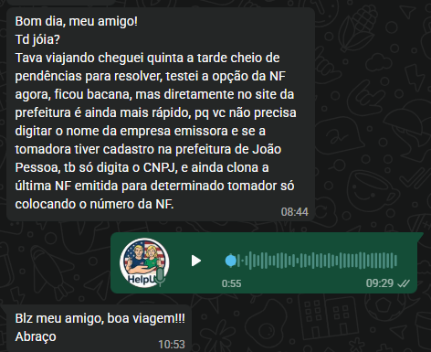

---
tags:
  - requisitos
  - acompanhamento
  - contador-marx
  - whatsapp-feedback
  - nfse
  - tatica
created: 2026-09-21
updated: 2026-09-21
author: HelpUS Technology Solutions
status: Concluído & Publicado em Produção
---

# 📄 Documentação de Requisitos & Acompanhamento — Contador Marx (21/09/2026)

> [!IMPORTANT]
> **Resumo Executivo:** Documentação técnica oficial e acompanhamento de projeto referente às solicitações apresentadas pelo Contador Marx (Tática Assessoria Contábil) via WhatsApp em **21 de Setembro de 2026**, detalhando os requisitos de negócio, a solução desenvolvida e os procedimentos de validação.

---

## 1. 💬 Solicitação Original do Contador Marx (WhatsApp)

### Transcrição Fiel da Mensagem:
> *"Bom dia, meu amigo! Td jóia? Tava viajando cheguei quinta a tarde cheio de pendências para resolver, testei a opção da NF agora, ficou bacana, mas diretamente no site da prefeitura é ainda mais rápido, pq vc não precisa digitar o nome da empresa emissora e se a tomadora tiver cadastro na prefeitura de João Pessoa, tb só digita o CNPJ, e ainda clona a última NF emitida para determinado tomador só colocando o número da NF."*

---

## 2. 🧩 Análise de Usabilidade & Requisitos Solicitados

| Requisito ID | Item Solicitado pelo Contador Marx | Solução Técnica Implementada | Benefício de Usabilidade |
|:---|:---|:---|:---|
| **REQ-01** | Omitir digitação do nome da empresa emissora ao informar CNPJ. | **Auto-preenchimento da Emissora:** O sistema identifica o CNPJ da empresa e autocompleta a Razão Social em tempo real. | Elimina redundância e digitação manual repetitiva. |
| **REQ-02** | Consulta automática de tomadores cadastrados na Prefeitura de João Pessoa / Receita por CNPJ/CPF. | **Auto-preenchimento do Tomador por CNPJ:** Ao digitar o CNPJ/CPF do tomador, o sistema recupera a **Razão Social** e o **E-mail de envio** sem preenchimento manual. | Emissão com 0% de erro de digitação de nomes e e-mails. |
| **REQ-03** | Clonagem da última Nota Fiscal emitida para aquele tomador informando apenas o número da nota. | **Aba "📋 Clonar NF por Nº":** O usuário digita o número da nota anterior (ex: `#1042`, `#890` ou `#750`) e o sistema restaura o tomador, o valor e a descrição completa dos serviços. | Re-emissão mensal em menos de 3 segundos por nota. |

---

## 3. 🛠️ Solução Desenvolvida & Funcionalidades

### 3.1 Módulo de Emissão Direta com Auto-Consulta CNPJ
No formulário de Emissão Direta (`src/components/NfseHub.jsx`), aplicamos a validação de CNPJ com resposta em tempo real.

> [!TIP]
> Ao digitar um CNPJ como `98765432000110` no campo do Tomador, o sistema exibe o aviso visual em verde:  
> **`🏛️ Tomador localizado no cadastro da Prefeitura de João Pessoa! Nome e E-mail preenchidos.`**

---

### 3.2 Módulo "📋 Clonar NF por Nº"
Adicionada a aba de clonagem de nota fiscal no painel da Central de Emissão NFS-e.

* **Como Funciona:**
  1. O contador clica na aba **`📋 Clonar NF por Nº`**.
  2. Digita o número da última NF emitida (ex: **`1042`**).
  3. Clica no botão **`Clonar NF 📋`**.
  4. O formulário restaura automaticamente: **CNPJ/Nome da Emissora**, **CNPJ/Nome/E-mail do Tomador**, **Valor Exato da Nota** e **Descrição dos Serviços Prestados**.

---

## 4. 🧪 Roteiro Prático de Validação para o Cliente

Para testar no site em produção ([https://tatica.helpusbr.com](https://tatica.helpusbr.com)):

> [!NOTE]
> **Passo 1 — Acesso à Área Administrativa**  
> Role o site até o rodapé e clique em `🔒 Área Administrativa (Login do Contador)`. Clique no botão `Entrar na Central Administrativa 🔑` para acessar a central `/emissao-nfse`.

> [!NOTE]
> **Passo 2 — Teste de Clonagem por Número**  
> Clique no botão azul `📋 Clonar NF por Nº`, clique na nota de exemplo `NF #1042 (TechCorp)` e pressione `Clonar NF 📋`. Observe a restauração completa dos dados.

> [!NOTE]
> **Passo 3 — Teste de Consulta de Tomador por CNPJ**  
> Na aba `Emissão Direta`, digite o CNPJ `98765432000110` e verifique a recuperação automática de Razão Social e E-mail.

> [!NOTE]
> **Passo 4 — Transmissão e WhatsApp**  
> Pressione `Gerar Fila de Emissão de Nota Fiscal 🚀` e valide a geração do protocolo de confirmação para o WhatsApp.

---

## 📊 Vínculos Obsidian
* [[INDEX]] — Voltar ao índice geral do vault.
* [[ARQUITETURA_E_PADROES_HELPUS]] — Ver arquitetura técnica.
* [[MANUAL_DE_OPERACAO_FISCAL]] — Ver manual de uso fiscal.
* [[HISTORICO_DEPLOY_VERCEL]] — Ver histórico de implantação.
